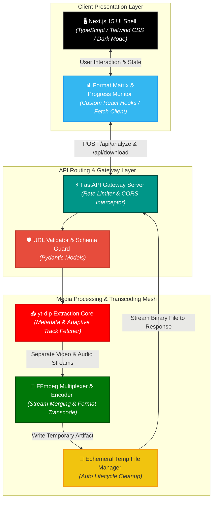

<div align="center">

# TubeDrop — YouTube Video Downloader

### Production-Ready Media Transcoding Engine, Adaptive Stream Multiplexing & Fast-Streaming API Architecture

**TubeDrop** is a full-stack media extraction and transcoding web application engineered to analyze, process, and download high-resolution YouTube video and audio streams. Powered by Next.js 15 (App Router) and Python FastAPI with an integrated `yt-dlp` and `FFmpeg` pipeline, TubeDrop features dynamic resolution selection (up to 4K), lossless audio demuxing (MP3, M4A, Opus), asynchronous stream merging, and automated ephemeral file lifecycle cleanup.

<p align="center">
  
  
  
  
  
  
  
</p>

<p align="center">
  <a href="https://github.com/shreeharsh-patil/TubeDrop/stargazers"></a>
  <a href="https://github.com/shreeharsh-patil/TubeDrop/issues"></a>
  <a href="LICENSE"></a>
</p>

</div>

---

## 🏛️ System Architecture & Stream Processing Pipeline

Extracting high-bitrate video and audio streams at scale requires isolation between metadata inspection, network I/O downloads, and CPU-intensive media transcoding.

**TubeDrop** employs a **Decoupled Asynchronous Transcoding Topology**. The Next.js client handles URL validation, interactive format picking, and real-time download progress visualizers, while the FastAPI gateway isolates media extraction into dedicated background tasks. Separate adaptive video and audio tracks are fetched concurrently via `yt-dlp`, multiplexed into target containers (MP4/MKV) with `FFmpeg`, and streamed as direct binary payloads with automated temporary disk cleanup.



> [!NOTE]
> **Ephemeral Storage Management:** Downloaded stream fragments and multiplexed outputs are allocated inside an isolated sandbox directory (`TEMP_ROOT`). Background worker hooks ensure that temporary binary files are unlinked from disk immediately following stream completion or download timeouts.

---

## 🔄 End-to-End Extraction & Transcoding Lifecycle

The sequence blueprint below shows the complete lifecycle of a video extraction request, from initial URL inspection to format resolution, stream merging, and binary payload delivery:

```mermaid
sequenceDiagram
    autonumber
    actor User as User / Client
    participant UI as Next.js 15 Frontend
    participant API as FastAPI Backend
    participant YTDL as yt-dlp Core
    participant FF as FFmpeg Transcoder
    participant FS as Temp Storage

    User->>UI: Paste YouTube URL & Click Analyze
    UI->>API: POST /api/analyze (JSON Payload)
    API->>YTDL: Query Video Formats & Metadata
    YTDL-->>API: Return Available Qualities (1080p, 4K, Audio)
    API-->>UI: Display Metadata Card & Resolution Selector

    User->>UI: Select Format (e.g., 1080p MP4) & Trigger Download
    UI->>API: POST /api/download (Format Parameters)
    
    rect rgb(20, 30, 20)
        note over API,FS: Stream Ingestion & Multiplexing
        API->>YTDL: Fetch Adaptive Video + Audio Tracks
        YTDL->>FS: Write Video & Audio Chunks
        API->>FF: Execute Transcode & Multiplex Command
        FF->>FS: Output Final Merged Container (MP4/MKV/MP3)
    end

    FS-->>API: Stream Binary File Payload
    API-->>UI: Pipe Download Stream (Content-Disposition: attachment)
    API->>FS: Trigger Asynchronous Ephemeral File Cleanup
    UI-->>User: File Saved to Local Downloads Folder
```



---

## ⚙️ Production Pipeline Implementation

| Pipeline Component | Technical Challenge | Our Solution Architecture |
| :--- | :--- | :--- |
| **1080p+ Stream Merging** | YouTube serves 1080p, 2K, and 4K video streams without native audio tracks. | Downloads separate high-bitrate video and audio streams concurrently and merges them using non-blocking `FFmpeg` processes. |
| **Rate Limiting & Abuse** | High-volume media downloads can exhaust network bandwidth and crash server memory. | Implements IP-based request throttling alongside strict payload size caps (`MAX_DOWNLOAD_SIZE = 2GB`). |
| **Ephemeral Disk Cleanup** | Failed downloads or abandoned user sessions leave orphan media files that fill server storage. | Uses automated temp-file tracking wrappers that delete intermediate `.part` and transcoded files immediately after streaming or timeouts. |
| **Responsive Interface** | Complex resolution dropdowns and download progress bars clutter mobile viewports. | Built with an adaptive Tailwind CSS grid supporting system dark/light themes, keyboard shortcuts, and responsive progress indicators. |

---

## 🚀 Deployment & Local Initialization

### Prerequisites
- **Runtime Environments:** Node.js >= 18.x, Python >= 3.10
- **System Binaries:** `yt-dlp` and `FFmpeg` installed and accessible via `$PATH`

#### macOS (via Homebrew):
```bash
brew install yt-dlp ffmpeg
```

#### Ubuntu / Debian:
```bash
sudo apt update && sudo apt install yt-dlp ffmpeg -y
```

#### Windows:
```powershell
# Install yt-dlp via pip
pip install yt-dlp

# Install FFmpeg (via winget or download from https://ffmpeg.org/download.html)
winget install Gyan.FFmpeg
```

---

### Step-by-Step Local Setup

#### 1. Repository Setup
```bash
# Clone the repository
git clone https://github.com/shreeharsh-patil/TubeDrop.git
cd TubeDrop
```

#### 2. Backend Initialization (FastAPI)
```bash
cd backend

# Create and activate virtual environment
python -m venv venv
source venv/bin/activate  # On Windows: venv\Scripts\activate

# Install Python requirements
pip install -r requirements.txt

# Start backend server
uvicorn main:app --reload --port 8000
```

#### 3. Frontend Initialization (Next.js 15)
```bash
cd ../frontend

# Install dependencies
npm install

# Start development server
npm run dev
```

- **Frontend Web Application:** [http://localhost:3000](http://localhost:3000)
- **Backend API Gateway:** [http://localhost:8000](http://localhost:8000)
- **Interactive API Documentation:** [http://localhost:8000/docs](http://localhost:8000/docs)

---

## 🐳 Containerized Infrastructure (Docker Compose)

Run the full-stack environment in isolated Docker containers:

```bash
# Build and run containerized services
docker-compose up --build -d

# Stop services
docker-compose down
```

---

## 🔐 Environment Variables Reference

### Backend (`backend/.env`)
```env
ALLOWED_ORIGINS="http://localhost:3000"
MAX_DOWNLOAD_SIZE=2147483648       # 2GB maximum limit
DOWNLOAD_TIMEOUT=600               # 10 minutes timeout window
RATE_LIMIT=30                      # Requests per minute per IP
TEMP_ROOT="/tmp/yt-video-downloader"
FFMPEG_PATH="ffmpeg"
FFPROBE_PATH="ffprobe"
```

### Frontend (`frontend/.env.local`)
```env
NEXT_PUBLIC_API_BASE_URL="http://127.0.0.1:8000"
```

---

## 📡 API Reference

### `POST /api/analyze`
Extracts structured video metadata and format maps from a given URL.

**Request:**
```json
{
  "url": "https://www.youtube.com/watch?v=dQw4w9WgXcQ"
}
```

**Response:**
```json
{
  "title": "Rick Astley - Never Gonna Give You Up",
  "thumbnail": "https://i.ytimg.com/vi/dQw4w9WgXcQ/maxresdefault.jpg",
  "channel": "Rick Astley",
  "duration": 212,
  "formats": [
    { "format_id": "137+140", "quality": "1080p", "ext": "mp4", "filesize": 45120000 },
    { "format_id": "140", "quality": "128k", "ext": "m4a", "filesize": 3400000 }
  ]
}
```

### `POST /api/download`
Streams the transcoded binary media payload with `Content-Disposition` attachment headers.

---

## 📂 Repository Directory Architecture

```
TubeDrop/
├── frontend/                        # Next.js 15 Presentation Client
│   ├── src/
│   │   ├── app/                     # App Router layouts, pages, route definitions
│   │   ├── components/              # URL input forms, format cards, theme toggles
│   │   ├── hooks/                   # useDownloader and progress state hooks
│   │   ├── lib/                     # API client and utility formatters
│   │   └── types/                   # TypeScript API contract definitions
│   ├── package.json                 # Frontend package manifest
│   └── Dockerfile                   # Frontend container build instructions
├── backend/                         # Python FastAPI Service
│   ├── app/
│   │   ├── models/                  # Pydantic validation schemas
│   │   ├── routes/                  # API route controllers: /analyze, /download, /health
│   │   ├── services/                # yt-dlp extractors, FFmpeg runners, temp managers
│   │   └── utils/                   # File helpers, stream sanitizers, rate limiters
│   ├── main.py                      # FastAPI application entrypoint
│   ├── requirements.txt             # Python package manifest
│   └── Dockerfile                   # Backend container build instructions
├── docker-compose.yml               # Multi-container orchestration
├── .env.example                     # Environment template file
└── README.md                        # Unified platform documentation
```

---

## ⚖️ Legal Guidelines & License

> [!WARNING]
> This platform is distributed under the terms of the MIT License. It is an independent open-source engineering project built for media pipeline research, transcoding evaluations, and software portfolio benchmarks. Users are responsible for respecting content copyright policies and adhering to platform Terms of Service.

---

## 👨‍💻 Project Author

Developed and Maintained by **Shreeharsh Patil**.

Feel free to contact me or submit issues via:
- **Email:** `shreeharsh.dev@gmail.com`
- **GitHub Profile:** [github.com/shreeharsh-patil](https://github.com/shreeharsh-patil)
